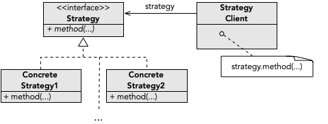

Este exercício lida com o problema de concretização automática de mapeamento objeto-relacional. Ao utilizar uma base de dados SQL, as entidades de um sistema estão representadas em tabelas. Cada linha destas tabelas representará um objeto no sistema, que será manipulado com a linguagem de programação. A tradução entre linhas de tabelas e objetos pode ser feita manualmente, porém existem tecnologias que fornecem formas automáticas de o fazer (p.e. [Hibernate](https://hibernate.org)).

O objetivo é gerar instruções SQL a partir do código das classes, por via de reflexão. Numa primeira fase vamos gerar instruções simples de CREATE TABLE e INSERT INTO, para objetos apenas com propriedades de valor. Considere que apenas são suportados os tipos (String, Int, Double, Boolean, e enumerados). Utilizaremos o seguinte código como exemplo.



<hr>


### 1. CREATE TABLE

Escreva uma função que dada uma classe, produza a instrução SQL de CREATE TABLE, tendo em conta as propriedades, e utilizando os tipos de dados de MySQL (por exemplo), ou outra tecnologia.



```
CREATE TABLE Student (number INT NOT NULL, name VARCHAR(255) NOT NULL, type VARCHAR(8));
```


### 2. INSERT INTO
Escreva uma função que dado um objeto, produza a instrução SQL de INSERT, tendo em conta a estrutura da classe. Naturalmente, esta função deverá ser coerente com a anterior.



```
INSERT INTO Student (name, number, type) VALUES ('Cristiano', 7, 'Doctoral');
```


### 3. Variabilidade de tecnologia SQL
O SQL dado acima é suportado pelas bases de dados [MySQL](https://www.mysql.com). Porém, diferentes tecnologias podem ter tipos de dados diferentes. O objetivo desta alínea é flexibilizar a geração das instruções SQL ao nível dos tipos de destino. Ou seja, iremos permitir que as chamadas acima possam ser feitas para diferentes tecnologias, sem ter que as antecipar todas as possíveis na implementação base.

A solução pode ser concretizada tendo uma interface para representar uma estratégia de mapeamento, que é utilizada para configurar o objeto gerador.  As duas funções também podiam ser tratadas isoladamente, mas umas interface única será mais explícita na relação entre ambas.



Este tipo de solução é uma instância do padrão de desenho Estratégia (*Strategy*), muito utilizado quando queremos fazer variar a forma de concretizar uma funcionalidade. Um aspeto chave neste padrão é *não ter dependência* entre o código cliente da estratégia e as suas várias variantes, mas sim depender da interface.




### 4. Anotações
Nos casos anteriores não são tratadas especificidades de SQL, tais como o controlo de utilização *NULL* e chaves primárias. Por outro lado, os identificadores são obtidos diretamente do nome das propriedades, não permitindo flexibilizar este aspeto.

A ideia desta alínea é fazer evoluir a solução anterior por forma a permitir tratar destes aspetos anotando as classes com anotações dedicadas para o efeito, fazendo com que o SQL gerado tenha isso em conta.




```
CREATE TABLE STUDENT (number INT PRIMARY KEY, name VARCHAR(50) NOT NULL, degree VARCHAR(8));
```

- **@DbName**: pode ser aplicada na classe ou numa propriedade, e tem ela própria uma propriedade para definir o identificador a utilizar no SQL.

- **@Length**: pode ser aplicada numa propriedade do tipo String, e indica o número de carateres disponíveis no campo da tabela da base de dados.

- **@PrimaryKey**: pode ser aplicada em apenas um campo (numérico ou String), indicando que se trata da chave primária.
